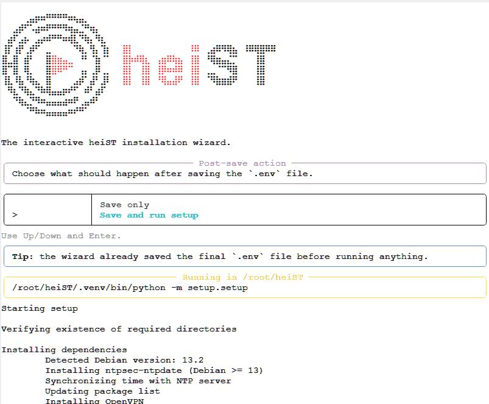
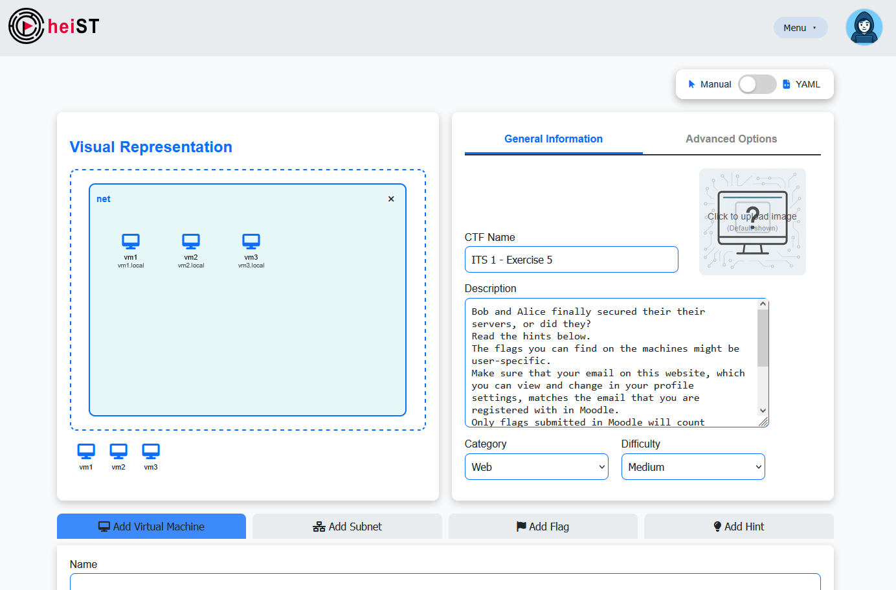
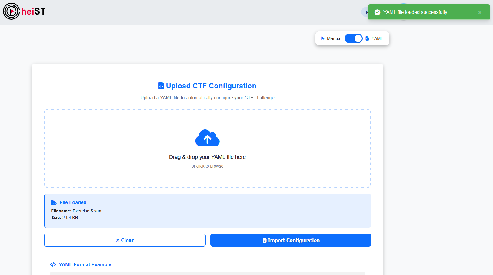
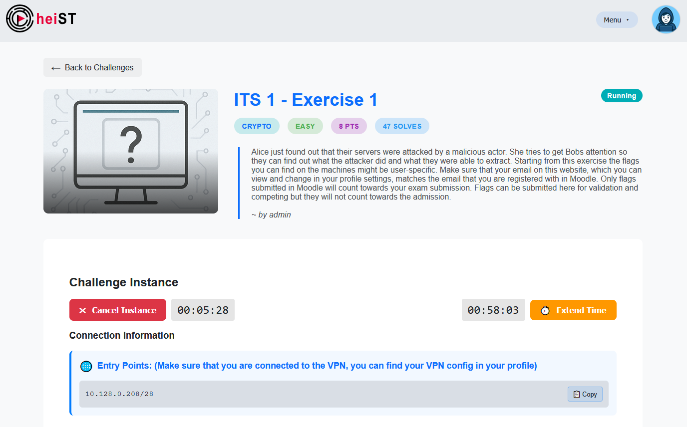
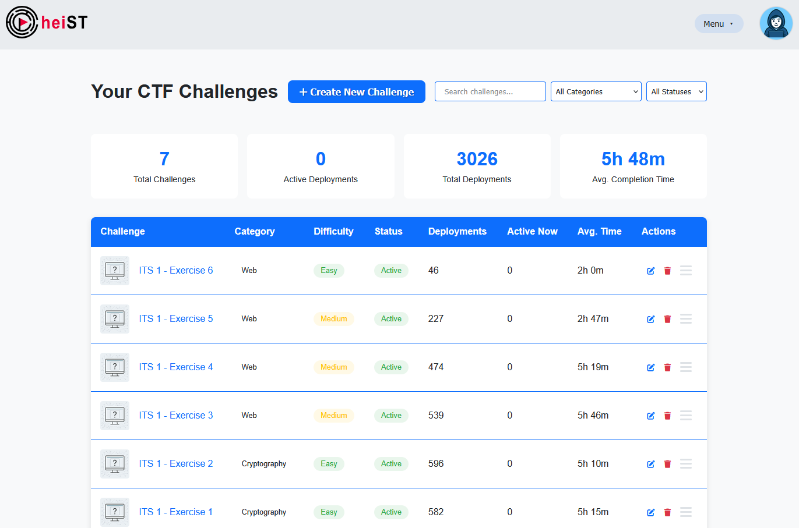

<a id="readme-top"></a>

<!-- PROJECT SHIELDS -->
<div align="center">

[![Contributors][contributors-shield]][contributors-url]
[![Forks][forks-shield]][forks-url]
[![Stargazers][stars-shield]][stars-url]
[![Issues][issues-shield]][issues-url]


</div>

<!-- PROJECT LOGO -->
<br />
<div align="center">
  <picture>
    <source
      srcset="assets/logo/logo_dark.svg"
      media="(prefers-color-scheme: dark)"
      height="200"
    />
    
  </picture>


  <h3 align="center">Heidelberg Security Training - CTF-Challenges for everyone</h3>

  <p align="center">
    All-in-one security training platform for everyone, everywhere. Keep control over your training environment, learn
    by doing, and have fun while doing it. <br />
    <!-- TODO: ADD DOCUMENTATION
    <br />
    <a href=""><strong>Explore the docs »</strong></a>
    <br /> -->
    <br />
    <a href="https://github.com/EMCL-Research-ITSecLab/heiST/issues/new?template=bug_report.md">Report Bug</a>
    ·
    <a href="https://github.com/EMCL-Research-ITSecLab/heiST/issues/new?template=feature_request.md">Request Feature</a>
  </p>
</div>


## Getting Started

### Prerequisites
- Proxmox VE 9.1-1, other versions might work but are not tested yet
- Python 3.x, the [installer](bin/install) will install version 3.12 to ensure compatibility with all dependencies during the installation process
- `root` access to the Proxmox VE host, including the `root` password, Proxmox's hostname, and information about the network configuration (internal and external IP address if the application will run in a NAT environment)

### Quick Installation

1. Start from a completely clean Proxmox VE installation, ideally directly after the Proxmox VE installation process has finished and the machine has rebooted
2. Install `git` on the Proxmox VE host and clone the repository into `/root/heiST`:
```sh
apt update
apt install -y git
git clone https://github.com/EMCL-Research-ITSecLab/heiST.git /root/heiST
```
3. Run the installation script:
```sh
cd /root/heiST
bin/install
```
4. Wait for the installation process to bootstrap the application, which might take around 5 minutes.
5. Navigate through the setup wizard in *Simple Mode*, setting the Proxmox VE hostname, the `root` password, and the network configuration.
6. (Optional) Set up the web applications `admin` password.
7. Navigate to *Save configuration and continue*, confirm your changed variables, and select *Save and run setup* to start the setup process.
8. Wait for the setup process to finish, which might take up to 60 minutes, depending on the hardware of the Proxmox VE host.
9. After the setup process has finished, you can access the web application at `https://<proxmox_host_ip>`


<div align="center">
  <picture>
    <source
      srcset="assets/showcase/installer_dark.png"
      media="(prefers-color-scheme: dark)"
      width="600"
      style="border: white solid 1px; border-radius: 8px;"
    />
    
  </picture>
</div>


### Installation Verification
After the installation process has finished, you can verify that the application is running correctly by accessing the web application at `https://<proxmox_host_ip>`, and logging in with the `admin` user and the password you set during the installation process.
To verify that the monitoring system is working correctly, you can navigate to the *Grafana* dashboard at `https://<proxmox_host_ip>:3000/login`


## Usage

### Challenge Creation - Manual Creation

1. Login to the web application with the `admin` user and the password you set during the installation process.
2. In the navigation menu at the top, select *Upload Diskfile*.
3. Select your previously created `.ova` files, containing the challenge environment, and upload them to the platform.
   (In order for the platform to correctly process the uploaded files, ensure that `cloud-init` is installed and properly configured.
   Also, network interfaces need to be automatically set up using DHCP, with the settings to receive DNS entries via DHCP as well.)
4. After the upload has finished, navigate to *Create CTF* using the navigation menu.
5. Create virtual machines for the CTF by selecting the uploaded disk files, and configure the name, the number of CPU cores, the amount of RAM, and the domain name under which other virtual machines in the challenge environment can reach this virtual machine.
6. After creating the virtual machines, create at least one subnet, assigning which virtual machines are part of which subnet. This includes the option whether the subnet should be directly accessible for the users, and whether the virtual machines in the subnet should be able to access the internet. In order for the users to interact with the challenge, at least one subnet needs to be directly accessible.
7. Create flags for the CTF, these can be static flags, which you already placed in the challenge environment, or dynamic flags, for which a secret must be defined to generate user-specific flags during challenge deployment. For user-specific flags, define to which virtual machine the flag needs to be injected. Each flag can be assigned a point value, which will be awarded to the user upon successful submission of the flag.
8. (Optional) Create hints for the CTF, which can be unlocked by the users during the challenge by reaching a set number of points.
9. Create a name and description for the CTF, and assign a category and a difficulty level.
10. (Optional) Create a general hint (displayed to the users regardless of achieved points) and a solution.
11. Upload an image for the CTF, which will be displayed as a thumbnail in the CTF overview, and on the CTF details page.
12. Click on *Create CTF Challenge*, and wait for the platform to process the uploaded files and create templates for the virtual machines, which might take a few minutes.
13. After the CTF has been created, it can be deployed for the users.

<div align="center">
  <picture>
    <source
      srcset="assets/showcase/create_challenge_dark.png"
      media="(prefers-color-scheme: dark)"
      width="600"
      style="border: white solid 1px; border-radius: 8px;"
    />
    
  </picture>
</div>

### Challenge Creation - Automatic Creation
1. Follow steps 1-4 from the manual creation process.
2. Create a YAML file according to the [template](automatic_challenge_import/template.yaml) for the automatic challenge creation, defining the same parameters as in the manual creation process.
3. On the *Create CTF* page, select the *YAML* mode using the toggle at the top right, and upload your YAML file.
4. Click on *Create CTF Challenge*, and wait for the platform to process the uploaded files and create templates for the virtual machines, which might take a few minutes.
5. After the CTF has been created, it can be deployed for the users.

<div align="center">
  <picture>
    <source
      srcset="assets/showcase/create_challenge_yaml_dark.png"
      media="(prefers-color-scheme: dark)"
      width="600"
      style="border: white solid 1px; border-radius: 8px;"
    />
    
  </picture>
</div>

### Challenge Deployment
1. Navigate to the *Challenges* page using the navigation menu, and select the challenge you want to deploy.
2. Click on *Deploy Challenge* and wait for the platform to deploy the challenge.
3. After the deployment process has finished, the subnetworks that are accessible for the users will be displayed, and the users can start solving the challenge by interacting with the virtual machines in these subnetworks.

<div align="center">
  <picture>
    <source
      srcset="assets/showcase/deploy_challenge_dark.png"
      media="(prefers-color-scheme: dark)"
      width="600"
      style="border: white solid 1px; border-radius: 8px;"
    />
    
  </picture>
</div>

### Challenge Management
1. Navigate to the *Manage CTFs* page using the navigation menu to see an overview of all created challenges, including some basic information such as the name, category, difficulty level, activity status, and the current and total number of deployments.
2. Click on the *Edit* icon for a challenge to edit the challenge's basic information, such as the name, description, category, difficulty level, general hint, and solution. Other parameters such as the flags, hints, and virtual machine configurations cannot be edited after the challenge has been created, so in order to change these parameters, the challenge needs to be deleted and re-created with the new parameters.
3. Click on the *Delete* icon for a challenge to delete the challenge, which will either forcibly stop all active deployments of the challenge, or allow them to finish while preventing new deployments, depending on the selected option. After a challenge has been deleted, it cannot be deployed anymore, and all information related to the challenge will be removed from the platform, so make sure to export all necessary information before deleting a challenge.

<div align="center">
  <picture>
    <source
      srcset="assets/showcase/manage_challenges_dark.png"
      media="(prefers-color-scheme: dark)"
      width="600"
      style="border: white solid 1px; border-radius: 8px;"
    />
    
  </picture>
</div>


## Platform Architecture
<div align="center">
  <picture>
    <source
      srcset="assets/architecture/architecture_dark.svg"
      media="(prefers-color-scheme: dark)"
      height="400"
    />
    
  </picture>
</div>

The platform consists of four main components, the web application, the API, the database, and the monitoring system.
- The web application is built using an Apache server, which serves the frontend and backend of the application. Both of which are built from scratch using HTML, CSS, and JavaScript for the frontend, and PHP for the backend. The web application is responsible for handling user interactions, and interfacing with the API to perform actions such as creating and deploying challenges, and managing users. The base files used to set up the web server can be found in [`webserver/`](webserver/). It is set up on a dedicated virtual machine to ensure isolation and security of the web application, and to allow for better resource management and scalability.
- The API is built using Python and the Flask framework, and is responsible for handling the core logic of the application, such as creating and managing virtual machines, and processing the uploaded files for challenge creation. The API interfaces with the Proxmox VE host using the Proxmox API, and with the database to store and retrieve information about the challenges, users, and other relevant data. The full implementation of the API can be found in the [`backend/`](backend/) directory.
- The database is built using PostgreSQL, and is responsible for storing all the relevant data for the application, such as user information, challenge information, and other necessary data for the application to function properly. The database, including the schema and the necessary queries, is set up during the installation process, and can be found in the [`database/`](database/) directory. For the same reasons as the web application, the database is also set up on a dedicated virtual machine to ensure isolation and security, and to allow for better resource management and scalability.
- The monitoring system is built using onto Grafana, bundling information gathered from various sources to monitor the health of the platform, and to provide insights into the usage of the platform. This includes monitoring the other components of the platform, such as the web application, the database, and the Proxmox VE host, as well as monitoring the deployed challenges, such as the status of the virtual machines and the commands executed by the users.
  In addition, the monitoring system also captures network traffic to allow for network forensics and analysis. The files needed to set up the monitoring system, including the configuration files for the various components, can be found in the [`monitoring/`](monitoring/) directory. While the monitoring system is distributed across the Proxmox VE host, the other components of the platform, and the deployed challenges, there is a dedicated virtual machine that hosts the Grafana dashboard, and the wazuh manager, which collects the data from the other components and provides a central point for monitoring and analysis.

## Monitoring System Architecture

### Components
The monitoring system consists of the following components:
- **Grafana**: Grafana is used as the main dashboard for visualizing the collected data, and providing insights into the health and usage of the platform. It interfaces with the other components of the monitoring system to gather and display relevant information.
- **Prometheus**: Prometheus is used for collecting and storing metrics from the various components of the platform, such as the web application, the API, the database, and the Proxmox VE host. It provides a powerful query language to retrieve and analyze the collected metrics, which can then be visualized in Grafana.
- **Wazuh**: Wazuh is used for on-host monitoring of the virtual machines in the deployed challenges. It collects information about the processes running on the virtual machines, the commands executed by the users, and other relevant information for monitoring the challenges and providing insights into the users' interactions with the challenges.
- **Suricata**: Suricata is used for network monitoring and traffic analysis. It captures the network traffic to and from the deployed challenges, as well as between the core components of the platform and the internet. This allows for monitoring the network interactions of the users with the challenges, as well as monitoring the network traffic for potential security incidents and anomalies.
- **Zeek**: Zeek is used to parse the captured network traffic, and extract relevant information such as DNS queries, HTTP requests, and other relevant network interactions. This information is further analyzed to alert on potential security incidents, and to provide insights into the users' interactions with the challenges.
- **Vector**: Vector is used for log aggregation and processing. It collects logs from the various components of the platform, such as the web application, the API, the database, and the Proxmox VE host, as well as from Wazuh and Suricata. It processes and enriches the collected logs, and forwards them to Grafana for visualization and analysis.
   


<!-- CONTRIBUTING -->
## Contributing

Contributions are what make the open source community such an amazing place to learn, inspire, and create. Any
contributions you make are **greatly appreciated**.

If you have a suggestion that would make this better, please fork the repo and create a pull request. You can also
simply open an issue with the tag "enhancement".
Don't forget to give the project a star! Thanks again!

### Top contributors:

<a href="https://github.com/EMCL-Research-ITSecLab/heiST/graphs/contributors">
  
</a>


<p align="right">(<a href="#readme-top">back to top</a>)</p>

<!-- LICENSE -->

## License

Distributed under the CC BY-NC 4.0 license. See [LICENSE.md](LICENSE.md) for more information.

<p align="right">(<a href="#readme-top">back to top</a>)</p>


<!-- MARKDOWN LINKS & IMAGES -->
<!-- https://www.markdownguide.org/basic-syntax/#reference-style-links -->

[contributors-shield]: https://img.shields.io/github/contributors/EMCL-Research-ITSecLab/heiST.svg?style=for-the-badge

[contributors-url]: https://github.com/EMCL-Research-ITSecLab/heiST/graphs/contributors

[forks-shield]: https://img.shields.io/github/forks/EMCL-Research-ITSecLab/heiST.svg?style=for-the-badge

[forks-url]: https://github.com/EMCL-Research-ITSecLab/heiST/network/members

[stars-shield]: https://img.shields.io/github/stars/EMCL-Research-ITSecLab/heiST.svg?style=for-the-badge

[stars-url]: https://github.com/EMCL-Research-ITSecLab/heiST/stargazers

[issues-shield]: https://img.shields.io/github/issues/EMCL-Research-ITSecLab/heiST.svg?style=for-the-badge

[issues-url]: https://github.com/EMCL-Research-ITSecLab/heiST/issues

[license-shield]: https://img.shields.io/github/license/EMCL-Research-ITSecLab/heiST.svg?style=for-the-badge

[license-url]: https://github.com/EMCL-Research-ITSecLab/heiST/blob/master/LICENSE.md

[coverage-shield]: https://img.shields.io/codecov/c/github/EMCL-Research-ITSecLab/heiST?style=for-the-badge

[coverage-url]: https://app.codecov.io/github/EMCL-Research-ITSecLab/heiST
